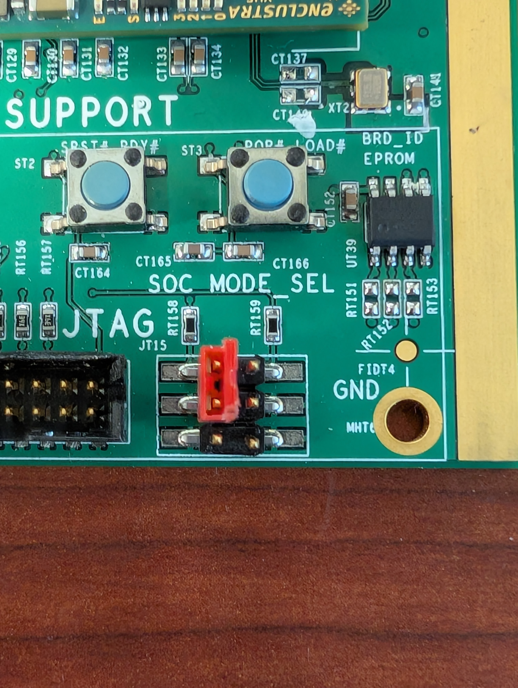

# Power and Timing Card v4 (PTCv4) Firmware

## Maintainer

Adrian Nikolica (nikolica@hep.upenn.edu)

## Contributors

* Adrian Nikolica
* Godwin Mayers
* David Drobner

## Documentation

* [(Old) PTCv3B Design Documentation](https://docs.dunescience.org/cgi-bin/private/ShowDocument?docid=6955)
* [Warm Interface Board v3 (WIBv3) Design Documentation](https://docs.dunescience.org/cgi-bin/private/ShowDocument?docid=24127)
* [Bristol Timing Endpoint Firmware](https://gitlab.cern.ch/dune-daq/timing/dune-timing-firmware)
* [Mercury XU5 PE1 Reference Design documentation](https://github.com/enclustra/Mercury_XU5_PE1_Reference_Design)
* [Petalinux documentation](https://github.com/enclustra/PetalinuxDocumentation)
* Enclustra Application Notes
  - [I2C AppNote](https://github.com/enclustra/I2CAppNote)
  - [Gigabit Ethernet AppNote](https://github.com/enclustra/GigabitEthernetAppNote)

## Changelog
See [Changelog](changelog.md).

## Description
This respository contains firmware and software source for PTCv4. Firmware runs on an Enclustra Mercury XU5 mezzanine (ME-XU5-5EV-2I-D12E variant). Software runs on an Infineon XMC4300 EtherCAT capable microcontroller.

### Directory Structure

|      |      |
| :--- | :--- |
| Mercury_XU5_PE1/ | Contains the recreated Vivado project. Does not need to be source controlled. |
| reference_design/src/ | Verilog source files, pin/timing constraint files |
| reference_design/scripts/ | Build scripts |
| reference_design/ip_repo/ | User-generated IP |

### Git instructions and building firmware
This project uses Vivado 2022.2 and petalinux 2022.2 in a Linux environment (Ubuntu 20.04.1 is used for development).

1. `git pull` changes from remote.
2. Open `vivado` from reference_design directory.
3. In tcl console, run `source ./scripts/create_project.tcl`. This recreated the project with block diagram.
4. Work on project using IDE. Build bitstream using the Vivado GUI.
5. Go to **File - Project - Write Tcl**. Set the output file to `create_project.tcl`. Check *Write all properties*, *Recreate Block Designs using Tcl*, and *Write object values*. Uncheck *Copy sources to new project*. Check the `git diff` output and ensure no files path names are corrupted before comitting changes.
6. All other HDL files should be kept in the src/ directory.
7. `git commit` all changes and `git push`.

### Building Software
1. First, from Vivado: **File - Export - Export Hardware - Include Bitstream** and export to the default *Mercury_XU5_PE1/* project directory (this will export an .xsa file).
2. **File - Export - Export Hardware - Export Bitstream File** and choose the
   same default directory as above. Name the file *Mercury_XU5_PE1.bit*.
3. In `yocto-workspace`, create the folder `hw-description`. Copy
   `Mercury_XU5_PE1.bit` to that folder
4. Change directory to hw-description and generate a sha256 checksum for the bitstream file: `sha256sum
   Mercury_XU5_PE1.bit > Mercury_XU5_PE1.bit.sha256`
5. In `yocto-workspace`, run `setup-yocto.sh` to clone the required layers
6. Go up a directory and then into `container`. Build the container using
   docker: `docker build -t crops-poky-xilinx:latest .`
7. Go back into `yocto-workspace`, and execute `run-container.sh` to enter the
   docker container. It will mount the yocto project as `/workdir`
8. Setup the yocto environment: run `source poky/oe-init-build-env build/`
9. Overwrite the pre-generated yocto configure with the example files: Run `cp
   conf/bblayers.conf.sample conf/bblayers.conf` and `cp conf/local.conf.sample
   conf/local.conf`. If asked if you want to overwrite, say yes.
    1. If you are running in the container, the bitbake layers will already be
       configured correctly. If not, edit bblayers.conf and update the paths
       accordingly.
10. Update the machine configuration by running
    `./gen-machine-conf/gen-machineconf parse-xsa --hw-description
    /workdir/hw-description/Mercury_XU5_PE1.bit --machine zynqmp-ptc`
11. To build the firmware, run `bitbake ptc-image`.
    1. Note that it is not necessary to manually package `BOOT.bin`, this will
       build the rootfs as well as bootloader.

### Booting software
#### Network Boot
1. Copy or symlink the files `boot.scr` and `image.ub` to a new folder.
2. Start an http server on the host PC serving that folder as it's root
    1. An easy way to do this is to go to the directory with your files, and run
       `sudo python3 -m http.server --bind 192.168.(PTC Subnet).(PC IP) 80`.
       Note that root access is required to bind to port 80.
    2. One may also set up a more production-ready webserver such as [nginx](#nginx-configuration) or
       apache to do so if desired
3. Load u-boot
    1. SD Card
        1. Create a new 256MB FAT32 partition called BOOT
        2. Copy `BOOT.bin` to the new partition
        3. Insert the SD card into the PTC
    2. QSPI
        1. For the initial boot, create a bootable SD card following the
           instructions above
        2. When the message to do so appears, press any key to stop autoboot
        3. Load the u-boot image into memory using `fatload mmc 1 0x10000000
           BOOT.bin`
        4. Probe the qSPI flash: `sf probe 0 0 0`
        5. Erase the flash: `sf erase 0x0 +${filesize}`
        6. Write the u-boot image to flash: `sf write 0x10000000 0x0
           ${filesize}`
        7. Ensure the jumpers are set correctly to use qSPI boot. On header
           J15, jump pins 1 and 3. See [below for an image](#qspi-boot-jumper-settings)
        8. For instructions on how to update the qSPI flash, see [Updating qSPI Flash](#updating-qspi-flash)
4. Set up a local DHCP server on the host PC
    1. Linux
        1. `dnsmasq` is one good option among many and is my personal choice.
           Install it via your package manager (e.g. `sudo apt install dnsmasq`) 
        2. Edit the configuration, usually located at `/etc/dnsmasq.conf` (Note
           that this location may vary distro-to-distro), insert the
           configuration given at the end of this section, ensuring to modify
           the values for your system
        3. Start the service: `sudo systemctl start dnsmasq`
        4. **(Optional, not recommended for development)** Enable `dnsmasq` as a service so it
           starts automatically at boot: `sudo systemctl enable dnsmasq`
    2. Windows
        1. Set up the Windows Subsystem for Linux, and follow the above instructions
5. Apply 48V to the main power connector

##### dnsmasq Configuration
Here is a template for the dnsmasq configuration
```properties
listen-address=192.168.(PTC Subnet).(PC IP)
interface=(check using ip a)
dhcp-range=192.168.(PTC subnet).50, 192.168.(PTC subnet).150, 12h
bind-interfaces
```
**Important**: Make sure that you restart dnsmasq after any configuration
changes by running `sudo systemctl restart dnsmasq`

Note that this provides 100 addresses which may be inadequate for production or
QC,
but is more than enough for some quick local tests.

#### nginx Configuration
On most distros, the nginx configuration is located at `/etc/nginx`. Generally,
you want to create a file in the `sites-available` folder for the server
configuration, and then symlink it into `sites-enabled`. On Fedora, the sites
are located at `/etc/nginx/conf.d/`. A valid server configuration is as follows:

##### netboot.conf
```nginx
server {
	listen <address>:80;
	server_name <address>;
   root <network boot folder>;
	disable_symlinks off;
	autoindex on;

	location / {
	    autoindex on;
	    
	    # Disable Keep-Alive for U-Boot compatibility
	    keepalive_timeout 0;
	    add_header Connection "close";
	}

	tcp_nodelay on;
	tcp_nopush off;
}
```

##### Firewall Configuration
Note that the system's firewall may block dns requests. On Fedora, I had to
either disable the firewall using `sudo systemctl stop firewalld`, or set the
interface I am running the server on to trusted, via `sudo firewall-cmd
--permanent --zone=trusted --change-interface=(interface)`, and then `sudo
firewall-cmd --reload`. 

On Ubuntu, the firewall can be disabled by running `sudo ufw disable`.

For Windows, either disable Windows Firewall, or set the network interface to
trusted. Also make sure you disable the firewall in WSL by using the above linux
instructions.

#### Updating qSPI Flash
Note that one can also use an SD card and follow the instructions in the
[Network Boot](#network-boot) section, but this is not strictly necessary.
1. Copy the new BOOT.bin to a webserver (the same one you boot from works)
2. Write the new image
    1. From u-boot
        1. Get an IP address: `setenv autoload no; dhcp`
        2. Download the new binary: `wget 0x10000000 192.168.(PTC subnet).(Server
           IP):/BOOT.bin`
        3. Probe the qSPI flash: `sf probe 0 0 0`
        4. Erase the qSPI flash: `sf erase 0x0 +${filesize}`
        5. Write the qSPI flash: `sf write 0x10000000 0x0 ${filesize}`
        6. Optionally, verify the flash was written correctly
           1. Read the flash into a new memory location: `sf read 0x20000000
              ${filesize}`
           2. Generate crc32 for the image: `crc32 0x10000000 ${filesize}`
           3. Generate crc32 for the flash: `crc32 0x20000000 ${filesize}`
           4. Ensure they both match. If not, try repeating all of the steps
              again. If that fails, it is likely a hardware issue.
    2. From Linux
        1. Download the new u-boot image: `wget http://{server ip}/BOOT.bin`
        2. Flash the image: `flashcp -v BOOT.bin /dev/mtd0`
3. Reboot

*N.B.* The instructions above can be run from u-boot already on the qSPI. The
bootloader is loaded into memory upon powerup, so it does not conflict with the
running environment.

#### qSPI Boot Jumper Settings


### Starting PTC in a WEIC
1. Ensure lower nibble of SW is set to preferred backplane address (default is 0xF; all pulled up), and all default jumpers are installed on PTC. Connect microUSB to the front panel to a terminal emulator. Connect 1000Base-BX from SFP2 to a Bristol timing master. Connect a 1000Base-LX SFP from SFP0 to a fiber to topical converter (like 10GTek A7S2-33-1GX1GT-SFP/GT3) and then to the PC.
3. After applying 48V, it will take a few seconds for the FPGA to power. You’ll see 3 green LEDs on the front go on: 12V_LOCAL, SOC_PG, and FPGA_DONE. You may see a red OVER_TEMP LED go on at powerup, but it will turn off after the FPGA powers on. You’ll also see a blinking amber LED on the Enclustra FPGA mezzanine after a few seconds.
4. Connect to the front panel UART at 115,200 baud, 8-bit data, 1 stop bit, no parity or flow control. You may need to install the [MaxLinear XR21V1410 drivers]( https://www.maxlinear.com/product/interface/uarts/usb-uarts/xr21v1410).
5. Run the following scripts:
`python3 power_on_wib.py [wib] [on|off]`
Where `[wib]` is the slot 0 through 5 that your WIB(s) are plugged into.
`python3 setup_timing.py`
You should see a green TIMING_GOOD LED go on the PTC front panel.
`python3 start_i2c.py`
You should printouts on the PTC terminal that show the state of various sensors.

### Setting up EtherCAT
1. The EtherCAT microcontroller project is based on the [Infineon reference design](https://www.infineon.com/dgdl/Infineon-XMC4300_Relax_EtherCat_APP_Slave_SSC-GettingStarted-v04_02-EN.pdf?fileId=5546d46254e133b401554f4951cc6447). Ensure that the same version of tools are installed. Beckhoff TwinCAT3 is needed to initiate a connection to PTC. Infineon DAVE v4.1.4 or higher and the Beckhoff SSC tool v5.12 are used for creating the initial project, but is only needed for development. 
2. The first time the link is set up, or if any configuration changes, copy the `XMC_ESC.xml` file (the "ESI file") to `C:\TwinCAT\3.1\Config\Io\EtherCAT` on the host PC. 
3. Connect a 100Base-FX SFP to SFP1, with an LC-to-SC fiber connection. For bench testing, this can be connected to a optical-to-fiber converter (like the tp-link MC100CM). For DDSS connection, this will be connected to the Beckhoff EK1521 terminal. In the case of the EK1521, a second RJ-45 connection from an EK1100 to the host PC is needed.
4. Open up the TwinCAT project in the `ethercat/` directory.
5. Double click on "Device 1 (EtherCAT)" and click on the "Adapter" panel. Ensure that the correct PTC Ethernet interface is selected. 
6. Right click on Device 1, and click "Scan". A message saying "Configuration matched" should appear. 
7. Now click on the "Online" tab. PTC should appear as a "Box" and be labelled "XMC_ESC". 
8. In the top menu bar, click on the "Toggle Free-Run State" icon (a red circular arrow). 
9. Now the PTC can be changed to "Op" mode in the Online panel. There will be constant frame counters in this panel, and no lost frames. This means PTC is maintaining an EtherCAT link. On the EK1521, the "RUN" LED will be constantly illuminated. The PTC Debug LEDs will show: ERR=GREEN, LINKB=GREEN, PHY_KED2=BLINK GREEN. 

### Developing with EtherCAT
1. Open DAVE and open the project at `ethercat/xmc_4300_proj/`. This is an Eclipse-like environment where the code can be modified asnd re-built.
2. The EtherCAT block is implemented in a DAVE "App" and has minimal configuration.
3. To change the data exchange types that PTC uses, the `XMC_ESC.xlsx` Excel file definitions need to be changed using SSC OD tool.exe. See the [Beckhoff ET9300 app note](https://download.beckhoff.com/download/document/io/ethercat-development-products/an_et9300_v1i8.pdf). 
4. If the DAVE project is modified, it must be reloaded onto the XMC4300 using the [KITXMCLINKSEGGERV1TOBO1 JTAG pod](https://www.digikey.com/en/products/detail/infineon-technologies/KITXMCLINKSEGGERV1TOBO1/5970448?s=N4IgTCBcDaIB4FsDGACANgSwHYGsQF0BfIA) connected to J6 on the PTC. (There is a provision to reprogram from the FPGA, but this is not implemented at the time of this writing). This only needs to be done once, and successive power-ups will retian the programming. To program the XMC4300 without using DAVE, the [J-Flash Lite](https://www.segger.com/downloads/jlink/) utility will still need to be used with the Infineon programming pod. The `.hex` file generated in `ethercat/xmc_proj/Debug` is used.
5. A preliminary data exchange test exists. To run it, use `python3 ecat_test1.py`, which will send one temperature reading and the 48V line current across the EtherCAT link. The IN_GENERIC_INT values in TwinCAT will show: TMP117 ADC counts, LTC2945 ADC counts, an alignment word (0xcafe), and a sequence number 0-65535 that updates once per second with the ADC reads and rolls over. Provision to exhange further data between the FPGA an XMC4300 is pending.

<!-- 
### To set up a permanent IP address:
1. Change the `setup_timing.py` script to use your IP address of choice.
2. Create a script `/etc/init.d/start_network.sh` with the following lines, which will run the above script to enable the Zynq GbE controller <sup>2</sup>and eth1 interface (and enable the timing interface):

`#!/bin/sh`

`python3 /home/root/setup_timing.py`

3. Make the script executable with `chmod +x`.
4. Issue the following commands to make symbolic links to this script in the appropriate startup directories, which will run the script at bootup:

`ln -s /etc/init.d/start_network.sh /etc/rc2.d/S99start_network.sh`

`ln -s /etc/init.d/start_network.sh /etc/rc3.d/S99start_network.sh`

`ln -s /etc/init.d/start_network.sh /etc/rc4.d/S99start_network.sh`

`ln -s /etc/init.d/start_network.sh /etc/rc5.d/S99start_network.sh`

5. Test by powering down PTC with `init 0` and turning off the main 48V supply, waiting a minute for the supply capacitors to discharge, and then powering on again. The PTC should show eth1 up and running with the IP address chosen in step 1. 
-->
### To transfer files to and from PTC:
1. From host to PTC (from host): `rsync -avzh [file to transfer] root@[your IP address]:/home/root/`
2. From PTC to host (from host): `rsync -avzh root@[your IP
   address]:/home/root/[file to transfer] .`

### Netboot Technical Notes
Here, we give a more complete description of how the network boot is configured
as it is slightly nonstandard. Due to some issues with the new u-boot IP stack,
we must use the legacy stack which does not support `bootmeth_http` allowing the
standard bootflow using http boot. We avoid this by using the
legacy<sup>[3](#footnotes)</sup> BOOT.scr format. The flow is as follows:
1. u-boot is compiled with default boot command set to `setenv autoload no;
   dhcp; wget ${scriptaddr} ${serverip}:/boot.scr; source ${scriptaddr}`
   1. This: disables autoboot after getting an ip from dhcp
   2. Gets an ip from dhcp 
   3. Downloads boot.scr from the dhcp server and puts it at
       `${scriptaddr}`
   4. Executes the script at `${scriptaddr}`
2. `boot.scr` (see `recipes-bsp/u-boot-xlnx-scr`) does the following:
   1. Sets the linux kernel cmdline
   2. Downloads the initramfs to `0x40000000` via http
   3. Boots the image at `0x40000000`

### Register reads and writes
At the root prompt, registers can be manually written using `poke [addr] [data]` from the table below. For example `poke 0x43c00000 0x00000020` will assert opad\_EXT\_RST. Test scripts (below) initiate sequences of register writes.

1. Control registers (R/W). All register bit defaults are low at powerup.

| reg. no. | AXI addr. | bit(s) | name | description |
| ------ | ------ | ------ | ------ | ------ |
| 0 | 0x80020000 | [0] | SOC_I2C_SW_RST | Reset 4-port I2C switch UT16 between SoC PS I2C, and PWR_SENSE and 3 SFPs. Active low (i.e. power-up in reset). |
| 0 | 0x80020000 | [8] | MCU_I2C_OE | Enable outputs on I2C level translator UT25 to route WIB I2C to MCU instead of SoC. NOTE: needs resistor change in HW to work. |
| 0 | 0x80020000 | [9] | WIB_I2C_OE | Enable outputs on I2C level translator UT29 to route WIB I2C to SoC. |
| 0 | 0x80020000 | [16] | bp_io_oe | Tri-state buffer enable to BP_IO_EN (active low) on level translator UT36, from WIB priority encode into SoC. Reg bit inverse to "T" buffer input. Reg low -> tri-state hi-Z -> OE on-board pullup -> no input to SoC. Reg high -> drive OE low -> can read lines from SoC. Low is used in conjunction with wib_rx_sel_out and wib_pe_soc_en when overriding priority encoder.  |
| 0 | 0x80020000 | [23] | crate_addr_en | Tri-state buffer enable to CRATE_ADDR_OE (active low) on level translator UB1, from backplane into SoC. Reg bit inverse to "T" buffer input. Reg low -> tri-state hi-Z -> OE on-board pullup -> no input to SoC. Reg high -> drive OE low -> can read lines from SoC. |
| 0 | 0x80020000 | [24] | crate_addr_out |  Deprecated. (To drive crate address out to WIB. Would have required HW change on level translator direction pin.) |
| - | - | - | - | - |
| 1 | 0x80020004 | [2:0] | wib_rx_sel_out | Use to drive clock MUX UT30 to select which WIB timing TX to route to SFP. Used in conjunction with wib_pe_soc_en and bp_io_en when overriding priority encoder. |
| 1 | 0x80020004 | [3] | wib_pe_soc_en | Tri-state buffer enable to level translator UT38, from priority encoder into clock MUX. Reg bit inverse to "T" buffer input. Reg low -> OE on-board pullup thru FET -> priority encoder output to clock MUX. Reg high -> OE pulled low thru FET -> can drive WIB_RX_SEL from FPGA. High is used in conjunction with wib_rx_sel_out and bp_io_en when overriding priority encoder. |
| 1 | 0x80020004 | [8] | sfp2_tx_en_reg | High = timing SFP JT5 force transmit (SFP_TX_DISABLE = low). For test only. |
| 1 | 0x80020004 | [9] | sfp2_tx_mux_ovr | High = timing SFP JT5 will transmit if any of BP_IO[5:0] driven from SoC are low. For test only. |
| 1 | 0x80020004 | [10] | ep_srst | Resets the timing endpoint firmware block. |
| 1 | 0x80020004 | [11] | ep_clk_sel | Switch BUFGMUX clk output in endpoint wrapper. Low = clk, high = rec_clk (bypass endpoint). Not currently used, as endpoint is for status indicator only. |
| 1 | 0x80020004 | [16] | WIB_CLK_SEL | Controls input of clock fanout UT37. Low = SFP RX gets fanned out to WIBs. High = SOC_AUX_CLK (internally generated). |
| 1 | 0x80020004 | [17] | mmcm_rst_n | Reset MMCM for SOC_AUX_CLK. Power-up: hold in reset. For test only. |
| - | - | - | - | - |
| 2 | 0x80020008 | [0] | EN_3V3 | Enable local 3.3V converter. Reg bit inverted. Power-up: OFF. |
| - | - | - | - | - |
| 3 | 0x8002000c | [0] | EN_2V5 | Enable local 2.5V converter. Reg bit inverted. Power-up: OFF. |
| - | - | - | - | - |
| 4 | 0x80020010 | [0] | VP12_EN0 | Enable WIB 0 power. Power-up: OFF. |
| - | - | - | - | - |
| 5 | 0x80020014 | [0] | VP12_EN1 | Enable WIB 1 power. Power-up: OFF. |
| - | - | - | - | - |
| 6 | 0x80020018 | [0] | VP12_EN2 | Enable WIB 2 power. Power-up: OFF. |
| - | - | - | - | - |
| 7 | 0x8002001c | [0] | VP12_EN3 | Enable WIB 3 power. Power-up: OFF. |
| - | - | - | - | - |
| 8 | 0x80020020 | [0] | VP12_EN4 | Enable WIB 4 power. Power-up: OFF. |
| - | - | - | - | - |
| 9 | 0x80020024 | [0] | VP12_EN5 | Enable WIB 5 power. Power-up: OFF. |
| - | - | - | - | - |
| 10 | 0x80020028 | [6:0] | vp12_sync_en[6:0] | Deprecated. (SYNC pin on all seven 12V converters. Requires resistor change in HW to work.) |
| - | - | - | - | - |
| 10 | 0x80020028 | [7] | lvsync_en | Deprecated. (SYNC pin on local 3.3V/2.5V converter. Requires resistor change in HW to work.)|
| - | - | - | - | - |
| 11 | 0x8002002c | [0] | xmc_jtag_en | Bit inverted. Low = all four buffers to control MCU JTAG interface are tri-stated so programming pod can be used. High = controlled by firmware. |
| 11 | 0x8002002c | [4] | cpu_tms_out | Assert TMS. |
| 11 | 0x8002002c | [5] | cpu_tck_out | Assert TCK. |
| 11 | 0x8002002c | [6] | xmc_tdi_n | Assert TDI. |
| 11 | 0x8002002c | [8] | xmc_reset_en | Active low reset to MCU. |
| - | - | - | - | - |
| 12 | 0x80020030 | [0] | SFP0_SPARE_LED | To be used as GbE link status controlled by SW. |
| 12 | 0x80020030 | [1] | OVER_TEMP_LED | To be used as OR of all temp sensor alerts controlled by FPGA. |

2. Status registers (R/O). 

| reg. no. | AXI addr. | bit(s) | name | description |
| ------ | ------ | ------ | ------ | ------ |
| 64 | 0x80020100 | [0] | SFP0_TX_FAULT | low = okay, high = fault detected |
| 64 | 0x80020100 | [1] | SFP0_LOS | low = signal present, high = loss of signal |
| 64 | 0x80020100 | [2] | SFP0_PRESENT | low = present, high = not present |
| 64 | 0x80020100 | [8] | SFP1_TX_FAULT | low = okay, high = fault detected |
| 64 | 0x80020100 | [9] | SFP1_LOS | low = signal present, high = loss of signal |
| 64 | 0x80020100 | [10] | SFP1_PRESENT | low = present, high = not present |
| 64 | 0x80020100 | [16] | SFP2_TX_FAULT | low = okay, high = fault detected |
| 64 | 0x80020100 | [17] | SFP2_LOS | low = signal present, high = loss of signal |
| 64 | 0x80020100 | [18] | SFP2_PRESENT | low = present, high = not present |
| - | - | - | - | - |
| 65 | 0x80020104 | [13:8] | BP_IO | Current status of priority encode lines from WIBs |
| 65 | 0x80020104 | [18:16] | wib_rx_sel_in | Current status of priority encode lines from WIBs |
| 65 | 0x80020104 | [27:24] | timing_stat | 4-bit status code from timing endpoint -- see Timing Integration document |
| 65 | 0x80020104 | [28] | timing_lock | Timing status LED (high when timing_stat = 0x8) |
| - | - | - | - | - |
| 66 | 0x80020108 | [6:0] | VP_12_IV_ALERT | Low = alert. Bit [6] is local DC-DC converter, and bits [5:0] are WIBs 5-->0 respectively. |
| 66 | 0x80020108 | [8] | VP2V5_ALERT | Low = alert. Local 2.5V DC-DC converter. |
| 66 | 0x80020108 | [9] | VP3V3_ALERT | Low = alert. Local 2.5V DC-DC converter. |
| 66 | 0x80020108 | [18:16] | OVER_TEMP | Low = alert. OR of temp sensor alerts. Bit [16] is OR of TU28, UT8, UT9, UT12. Bit [17] is OR of UT20, UT19, UT31, UT32. Bit [18] is currently unassigned. |
| 66 | 0x80020108 | [24] | VP48_IV_ALERT | Low = alert. Main 48V input monitor. |
| - | - | - | - | - |
| 126 | 0x800201f8 | [0] | mmcm0_locked | Internal MMCM for "fake" timing clock -- for test only.|
| - | - | - | - | - |
| 127 | 0x800201fc | [31:0] | 0xdeadbeef | Test register|

## Footnotes
1. This is done by creating an app template as in the [PetaLinux Yocto documentation](https://xilinx-wiki.atlassian.net/wiki/spaces/A/pages/18842475/PetaLinux+Yocto+Tips#PetaLinuxYoctoTips-CreatingApps(whichuseslibraries)inPetaLinuxProject)
2. The Zynq GbE interface is on the PS side using the GEM controller. The software driver mode is defined through Petalinux using the system-user.dtsi device tree file, which sets it as `is-internal-pcspma`. For some reason, the Xilinx drivers do not automatically enable the GEM when it's in this mode, so the script writes the correct values to the [network_config](https://www.xilinx.com/htmldocs/registers/ug1087/ug1087-zynq-ultrascale-registers.html) register for GEM1. An alternate solution is to [change the driver code](https://github.com/DUNE-DAQ/dune-wib-firmware/blob/master/linux-2020.1/project-spec/meta-user/recipes-kernel/linux/linux-xlnx/macb-5.4.patch#L30) as was done on the WIB.
3. This should not cause issues if we ever upgrade, as the issues with PSGTR
   ethernet will likely be fixed, so we can move to `bootmeth_http`